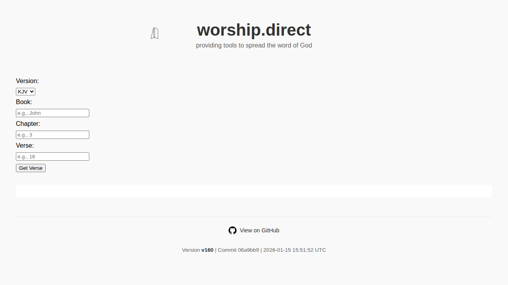
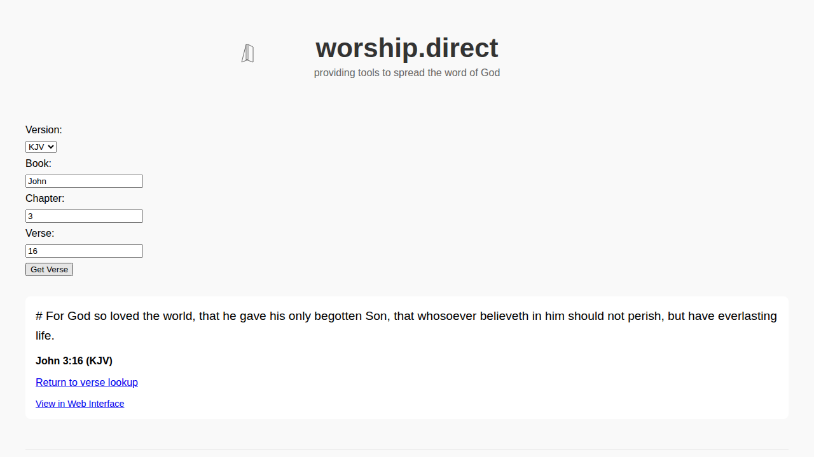
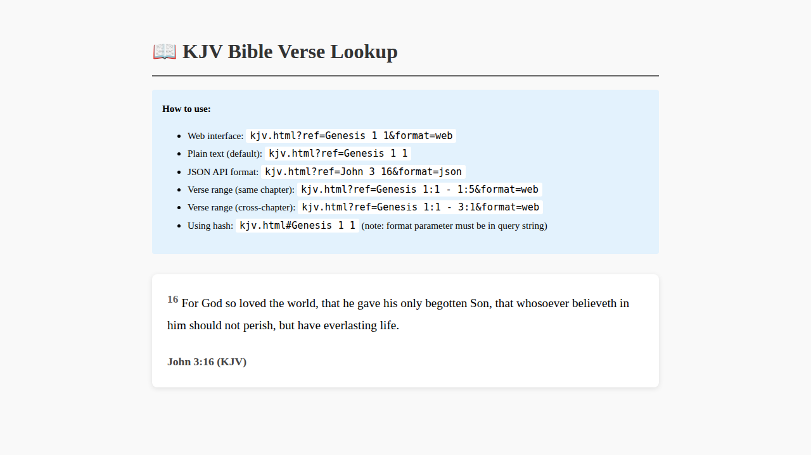
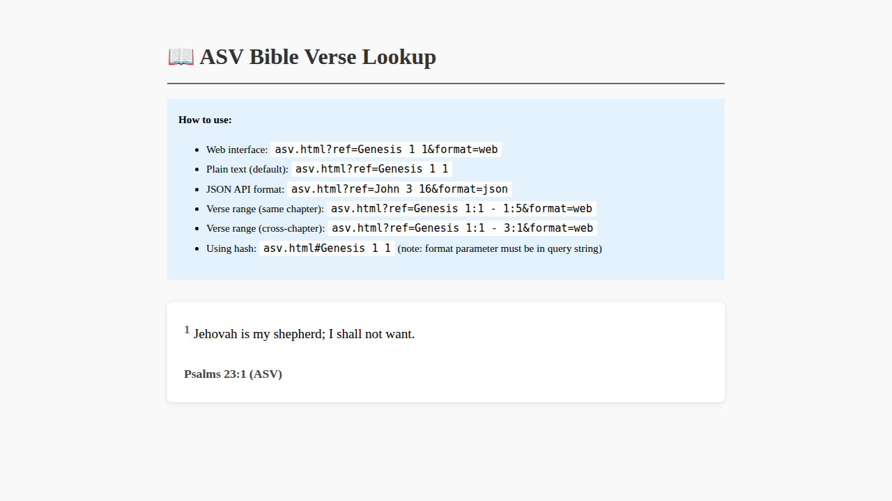
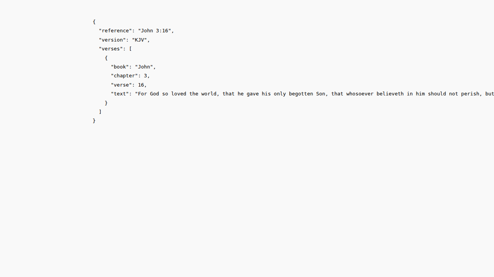
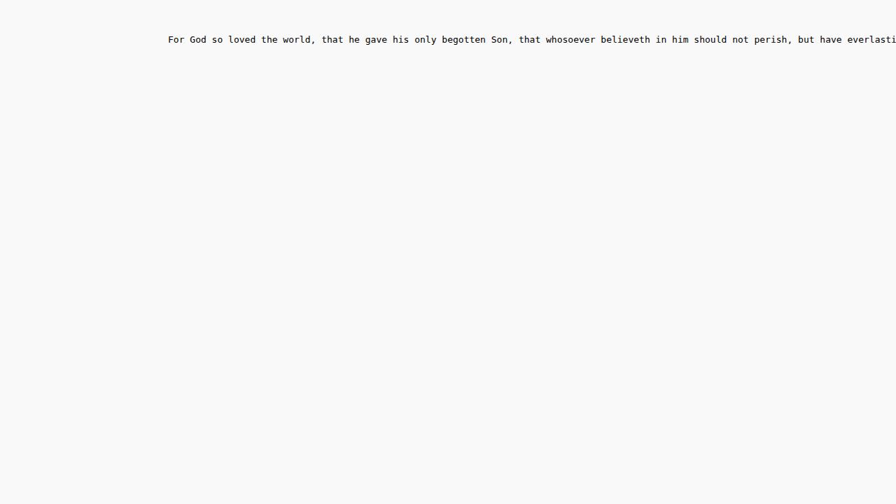

# 📖 Worship Direct Bible API (Static JSON)

Welcome to the **Worship Direct Bible API**. This is a static JSON-based API hosted via GitHub Pages. It provides full access to the **King James Version (KJV)** and **American Standard Version (ASV)** of the Bible.

## 📸 Screenshots

### Main Landing Page
The main page provides an interactive verse lookup interface:



### Verse Lookup Result
Example of looking up John 3:16 (KJV):



---

## 🌐 API Endpoints

### Nested Format (Recommended)
| Version | URL | Format |
|---------|-----|--------|
| **KJV** | [`https://worship.direct/bible/en/kjv.json`](https://worship.direct/bible/en/kjv.json) | Nested |
| **ASV** | [`https://worship.direct/bible/en/asv.json`](https://worship.direct/bible/en/asv.json) | Nested |

The **nested format** files are structured as nested JSON objects for easy REST API compatibility:

```json
{
  "John": {
    "3": {
      "16": "For God so loved the world..."
    }
  }
}
```

---

### HTML API Endpoints (Interactive & JSON API)
| Version | URL | Description |
|---------|-----|-------------|
| **KJV** | [`https://worship.direct/bible/en/kjv.html`](https://worship.direct/bible/en/kjv.html) | HTML interface with JSON API support |
| **ASV** | [`https://worship.direct/bible/en/asv.html`](https://worship.direct/bible/en/asv.html) | HTML interface with JSON API support |

The **HTML endpoints** provide both an interactive web interface and a JSON API mode for verse lookups.

#### KJV HTML Interface


#### ASV HTML Interface


#### URL Formats Supported:
- **Single verse (query parameter)**: `kjv.html?ref=Genesis 1 1&format=web` (space-separated)
- **Single verse (hash fragment)**: `kjv.html?format=web#Genesis 1 1` (note: format must be in query string)
- **Verse ranges (same chapter)**: `kjv.html?ref=Genesis 1:1 - 1:5&format=web` (colon notation for ranges)
- **Verse ranges (cross-chapter)**: `kjv.html?ref=Genesis 1:1 - 3:1&format=web`

#### Output Format Options:
The HTML endpoints support multiple output formats via the `format` parameter:

- **Plain Text Mode (default)**: No format parameter needed - returns raw verse text only
- **Web Interface**: Add `&format=web` to display verses in a formatted HTML interface
- **Widget Mode**: Add `&format=widget` to display only the verse container (for embedding in other websites/resources)
- **JSON API Mode**: Add `&format=json` to get structured JSON responses



**JSON Format Example:**

```bash
# Single verse
https://worship.direct/bible/en/kjv.html?ref=John 3 16&format=json

# Response format:
{
  "reference": "John 3:16",
  "version": "KJV",
  "verses": [
    {
      "book": "John",
      "chapter": 3,
      "verse": 16,
      "text": "For God so loved the world..."
    }
  ]
}
```

**Plain Text Format Example:**

```bash
# Single verse - returns only the verse text (default)
https://worship.direct/bible/en/kjv.html?ref=John 3 16

# Response (plain text):
For God so loved the world, that he gave his only begotten Son, that whosoever believeth in him should not perish, but have everlasting life.

# Verse range - returns concatenated verse text (default)
https://worship.direct/bible/en/asv.html?ref=Genesis 1:1 - 1:3

# Explicit format=txt also works
https://worship.direct/bible/en/kjv.html?ref=John 3 16&format=txt
```



**Web Interface Example:**

```bash
# Single verse - displays in formatted HTML interface
https://worship.direct/bible/en/kjv.html?ref=John 3 16&format=web

# Verse range - displays in formatted HTML interface
https://worship.direct/bible/en/asv.html?ref=Genesis 1:1 - 1:5&format=web
```

**Widget Format Example:**

```bash
# Single verse - displays only the verse container (no header/instructions)
# Perfect for embedding in iframes or other websites
https://worship.direct/bible/en/kjv.html?ref=John 3 16&format=widget

# Verse range - widget format
https://worship.direct/bible/en/asv.html?ref=Genesis 1:1 - 1:5&format=widget

# HTML embedding example:
<iframe src="https://worship.direct/bible/en/kjv.html?ref=John 3 16&format=widget" 
        width="100%" height="200" frameborder="0"></iframe>
```

---

## ✅ How to Use the API

### 📄 HTML/JavaScript Example (Nested Format)

```html
<script>
  fetch('https://worship.direct/bible/en/kjv.json')
    .then(res => res.json())
    .then(data => {
      const verse = data["John"]["3"]["16"];
      console.log("John 3:16 (KJV):", verse);
    });
</script>
```

### 🐍 Python Example (Nested Format)

```python
import requests

def get_verse(version, book, chapter, verse):
    url = f"https://worship.direct/bible/en/{version}.json"
    res = requests.get(url)
    if res.status_code != 200:
        return "Error loading Bible JSON"
    data = res.json()
    return data.get(book, {}).get(str(chapter), {}).get(str(verse), "Verse not found")

# Example usage
print(get_verse("kjv", "John", 3, 16))
```

### 🟦 Node.js Example (Nested Format)

```javascript
const axios = require('axios');

async function getVerse(version, book, chapter, verse) {
  try {
    const res = await axios.get(`https://worship.direct/bible/en/${version}.json`);
    const data = res.data;
    const text = data?.[book]?.[chapter]?.[verse];
    console.log(`${book} ${chapter}:${verse} (${version.toUpperCase()}):`, text || "Not found");
  } catch (err) {
    console.error("Failed to fetch verse:", err.message);
  }
}

getVerse("kjv", "John", "3", "16");
```

### 🌐 HTML API Examples

#### Using Query Parameters

```bash
# Fetch a single verse as JSON
curl "https://worship.direct/bible/en/kjv.html?ref=John 3 16&format=json"

# Fetch a verse range as JSON
curl "https://worship.direct/bible/en/asv.html?ref=Genesis 1:1 - 1:5&format=json"

# Fetch verse text only (plain text format - default)
curl "https://worship.direct/bible/en/kjv.html?ref=John 3 16"
```

#### JavaScript Fetch Example (HTML API)

```javascript
// Fetch verse from HTML API in JSON mode
fetch('https://worship.direct/bible/en/kjv.html?ref=John 3 16&format=json')
  .then(res => res.json())
  .then(data => {
    console.log(data.reference); // "John 3:16"
    console.log(data.verses[0].text); // The verse text
  });
```

#### Interactive Web Interface

Simply navigate to the HTML endpoint in a browser with a verse reference and format=web:
- `https://worship.direct/bible/en/kjv.html?ref=John 3 16&format=web`
- `https://worship.direct/bible/en/asv.html?ref=Psalm 23 1&format=web`

---

## 🛠️ Reformatting Scripts

The repository includes scripts to convert Bible JSON files to the standardized nested format:

### Available Scripts
- **Python**: `scripts/convert_asv_to_nested.py` and `scripts/convert_kjv_to_nested.py`
- **Node.js**: `scripts/convert_asv_to_nested.js` and `scripts/convert_kjv_to_nested.js`

### Usage
```bash
# Python
python3 scripts/convert_asv_to_nested.py
python3 scripts/convert_kjv_to_nested.py

# Node.js
node scripts/convert_asv_to_nested.js
node scripts/convert_kjv_to_nested.js
```

See [`scripts/README.md`](scripts/README.md) for detailed documentation.

---

## 🤖 Automated Workflows

### Screenshot Updates
The repository includes a GitHub Actions workflow that automatically updates screenshots when UI files are modified. The workflow:

- Triggers on pushes to `main` branch when `index.html`, Bible HTML files, JavaScript files, or `icon.html` change
- Can also be manually triggered via workflow_dispatch
- Uses Playwright to capture screenshots of:
  - Main landing page
  - Verse lookup results
  - KJV and ASV HTML interfaces (format=web)
  - Plain text API response (format=txt)
  - JSON API response (format=json)
- Automatically commits and pushes updated screenshots

See [`.github/workflows/update-screenshots.yml`](.github/workflows/update-screenshots.yml) for details.

---

## 🧰 File Structure

```
/worship.direct/
├── index.html
├── icon.html             # Reusable SVG logo
├── js/
│   └── api.js
├── bible/
│   └── en/
│       ├── kjv.json          # KJV Bible data (nested format)
│       ├── asv.json          # ASV Bible data (nested format)
│       ├── kjv.html          # KJV HTML API & interactive interface
│       └── asv.html          # ASV HTML API & interactive interface
├── screenshots/          # UI screenshots for documentation
│   ├── main-page.png
│   ├── verse-lookup-result.png
│   ├── kjv-html-interface.png
│   ├── asv-html-interface.png
│   ├── txt-format-response.png
│   └── json-api-response.png
├── scripts/              # Conversion scripts
│   ├── README.md
│   ├── convert_kjv_to_nested.py
│   ├── convert_asv_to_nested.py
│   ├── convert_kjv_to_nested.js
│   └── convert_asv_to_nested.js
├── .github/
│   └── workflows/
│       ├── update-version.yml
│       └── update-screenshots.yml
└── README.md ← (this file)
```

---

## 📬 Contributions & Ideas

Want to add features like verse ranges, search, or a hosted backend? Reach out or fork the project.

Blessings 🙏

kjv from https://github.com/farskipper/kjv?utm_source=chatgpt.com

asv from https://github.com/bibleapi/bibleapi-bibles-json/blob/master/asv.json?utm_source=chatgpt.com
